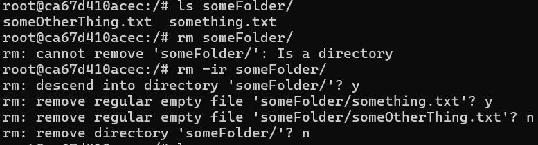

# Basic file management

``touch`` can be used to create a file. However, the reason why it's called touch is that it changes the file timestamps. And a side effect of it is that if the file does not exist, then it creates one.

In Linux, the extension of a file does not dictate the type of the file. To get the actual type of a file, you can run the `file` command.

If you want to create a directory, you can use ``mkdir <foldername>``.

To make a nested folder with one call, you can use the `-p` option with ``mkdir``.

```bash
mkdir -p SomeParent/SomeChild
```

## Remove

`rm <filename>` can be used to remove files. They will be permanently gone.

The `-d` flag can be added to remove empty folders.

`rm -d <empty folder name>`

If the folder is not empty, then `-r` can be used to delete them recursively.

To get confirmation when you're deleting, then the `-i` flag can be used.



## Moving stuff

The move command can be used to move things around:

```bash
mv <source> <destination>
```

You can move multiple files at once. Only the final parameter then will be considered the destination.

```bash
mv oneFile.txt twoFile.txt threeFile.txt SomeFolder/SomeWhere
```

The move command can also be used for renaming.

```bash
mv <current> <newname>

mv someFile.txt renamedFileName.txt
```

## Copying

To copy, the `cp` command can be used. Has the same format as move.

```bash
cp <originalFile> <copyFileName>

cp someFile.txt copyFileName.txt
```

To copy a folder and its contents, the `-r` flag can be added.

```bash
cp -r someFolder someOtherFolder
```