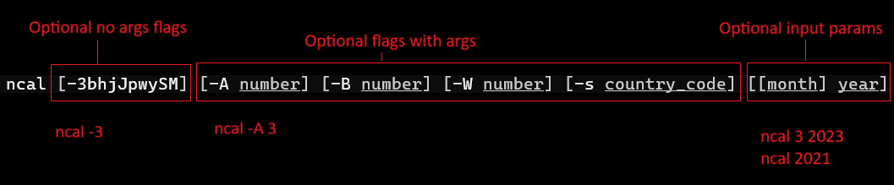
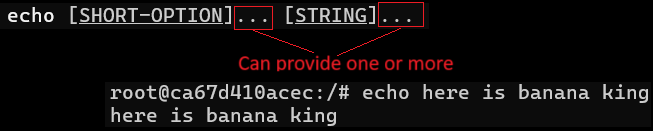
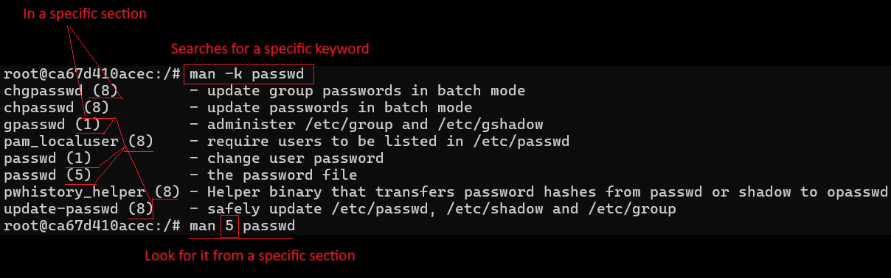
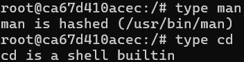
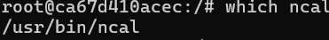

# Manual pages

Built-in form of documentation on nearly all UNIX-like OSes.

To read the manual pages:
```bash
man <command>
man ncal
```

Press `q` to exit the manual pages.

Hitting ``space`` scrolls an entire page of content forward. Hitting ``b`` goes one page backward.

To search by text, you can type ``/`` and then some pattern.
```bash
/ -w
```

When looking at the man page, and there are options listed inside brackets, then those are optional. Arguments that do not accept parameter are lumped together into one, and arguments that do are shown separately.

If there is a parameter that is not within brackets, then those are required.



When looking at ``echo``, then there's a SHORT-OPTION parameter there. Since all args are optional no args flags, then instead of writing them out, they've just lumped them together.

The three dots that follow signify that you can add multiple short options.



The manual pages have multiple sections to them (a total of 8).

Something with the same name might be in multiple sections, so if you're trying to get the man page for it, you might need to add a section.



You can look at the manual pages of the man command to see what each section stands for:
```bash
man man
```

The ``type`` command will tell you what type of a command one is.

There are four:
* An executable program - usually stored in /bin, /usr/bin, /usr/local/bin. Compiled binary files, hence bin.
* Built-in shell commands
* Shell function
* Alias



The `which` command con be used to see where a command is located.



Not every command has a man page entry, in which you could try running `help`.

For example:
```bash
help cd
```