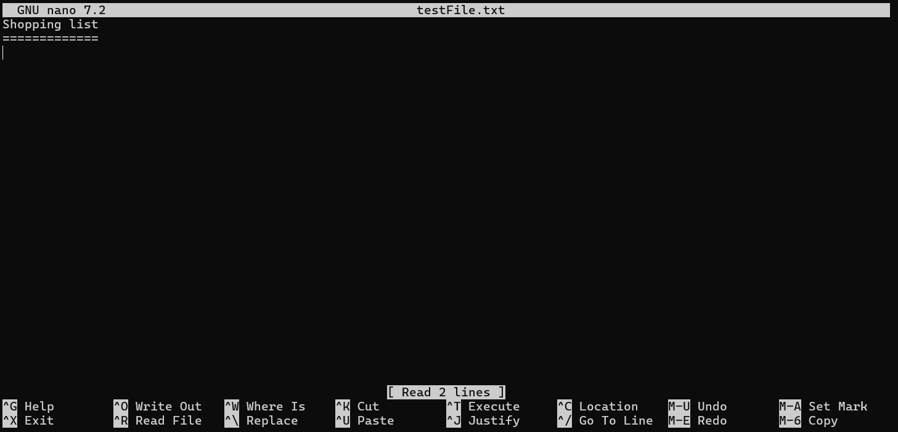

# Nano

Nano is one of the editors that you can use from the command line.

To open a file with Nano, you'd do `nano <filename>`. If the file does not exist, then Nano will still open, and you have the ability to save it, but simply opening it up with Nano does not create it.

You can see some shortcuts that are available to you under the screen. The caret means that it's ctrl + something.

So ^X means ctrl + X.

However, there are also additional shortcuts that are not listed there. For example to save without being prompted to confirm, you can use ctrl + S.

Ctrl + G can be used to see all the different shortcuts.

